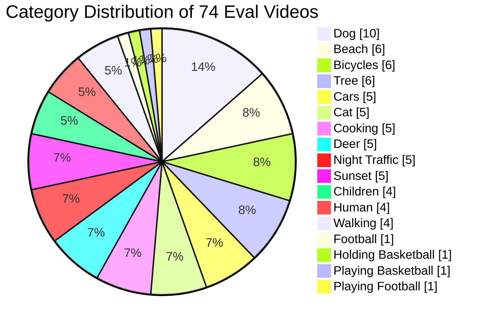
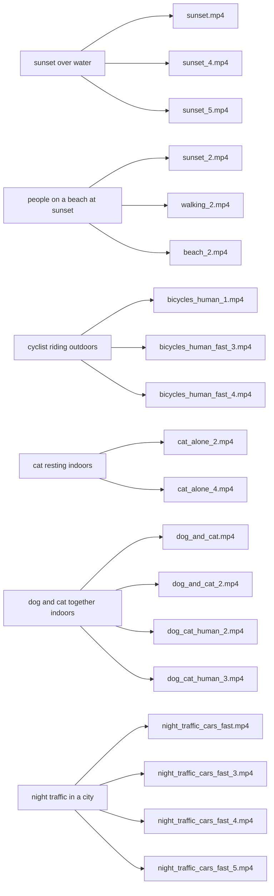

# Eval Videos Category Distribution

Dataset: `/home/chongshengwang/naratix/eval_videos`

Total videos: 74

## Counts

| Category | Count | Share |
| --- | ---: | ---: |
| Dog | 10 | 13.5% |
| Beach | 6 | 8.1% |
| Bicycles | 6 | 8.1% |
| Tree | 6 | 8.1% |
| Cars | 5 | 6.8% |
| Cat | 5 | 6.8% |
| Cooking | 5 | 6.8% |
| Deer | 5 | 6.8% |
| Night Traffic | 5 | 6.8% |
| Sunset | 5 | 6.8% |
| Children | 4 | 5.4% |
| Human | 4 | 5.4% |
| Walking | 4 | 5.4% |
| Football | 1 | 1.4% |
| Holding Basketball | 1 | 1.4% |
| Playing Basketball | 1 | 1.4% |
| Playing Football | 1 | 1.4% |

## Category Mapping Used

- Beach: `beach*`
- Bicycles: `bicycles*`
- Cars: `cars*`
- Cat: `cat*`
- Children: `children*`
- Cooking: `cooking*`
- Deer: `deer*`
- Dog: `dog*`
- Football: `football*`
- Holding Basketball: `holding_basketball*`
- Human: `human*`
- Night Traffic: `night_traffic*`
- Playing Basketball: `playing_basketball*`
- Playing Football: `playing_football*`
- Sunset: `sunset*`
- Tree: `tree*`
- Walking: `walking*`

## Shared-Content Retrieval Overlap

The pie chart shows only frequency. To show that multiple videos can match one mutual query, use a second many-to-many diagram where each shared concept or query points to all relevant videos.

## Why This Works Better

- The pie chart answers: how many videos are in each top-level category?
- The overlap diagram answers: which different videos share retrievable content under one query?
- One query node can connect to multiple videos, making shared semantics explicit.

## Better Options For This Dataset

- Bipartite graph: query/concept nodes on the left, video nodes on the right.
- Heatmap: rows as videos, columns as shared concepts, filled cells for matches.
- UpSet plot: best if you want to quantify intersections among multiple concepts.

## Example Mutual Queries

| Mutual query | Related videos |
| --- | --- |
| `sunset over water` | `sunset.mp4`, `sunset_4.mp4`, `sunset_5.mp4` |
| `people on a beach at sunset` | `sunset_2.mp4`, `walking_2.mp4`, `beach_2.mp4` |
| `cyclist riding outdoors` | `bicycles_human_1.mp4`, `bicycles_human_fast_3.mp4`, `bicycles_human_fast_4.mp4` |
| `cat resting indoors` | `cat_alone_2.mp4`, `cat_alone_4.mp4` |
| `dog and cat together indoors` | `dog_and_cat.mp4`, `dog_and_cat_2.mp4`, `dog_cat_human_2.mp4`, `dog_cat_human_3.mp4` |
| `night traffic in a city` | `night_traffic_cars_fast.mp4`, `night_traffic_cars_fast_3.mp4`, `night_traffic_cars_fast_4.mp4`, `night_traffic_cars_fast_5.mp4` |